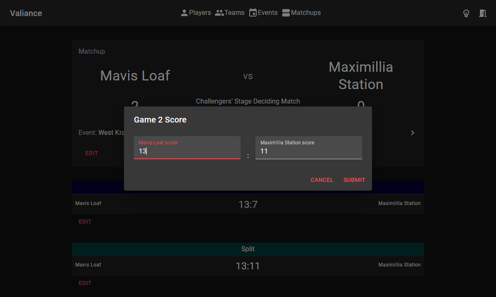

# Valiance

Valiance is a tournament organization system and database.

All users can view the players, teams, tournaments, and matchups, and logged in administrators can manage them. A player's and team's participations tournaments are also shown along with their information.

An administrator can manage a tournament's participants and start a tournament. This system takes care of the progression of a tournament. Only the outcome of a matchup must be entered and this system will automatically choose, based on the rules of the chosen tournament format, which participants to match with next round.

## Database schema

## Dark mode

## Light mode

